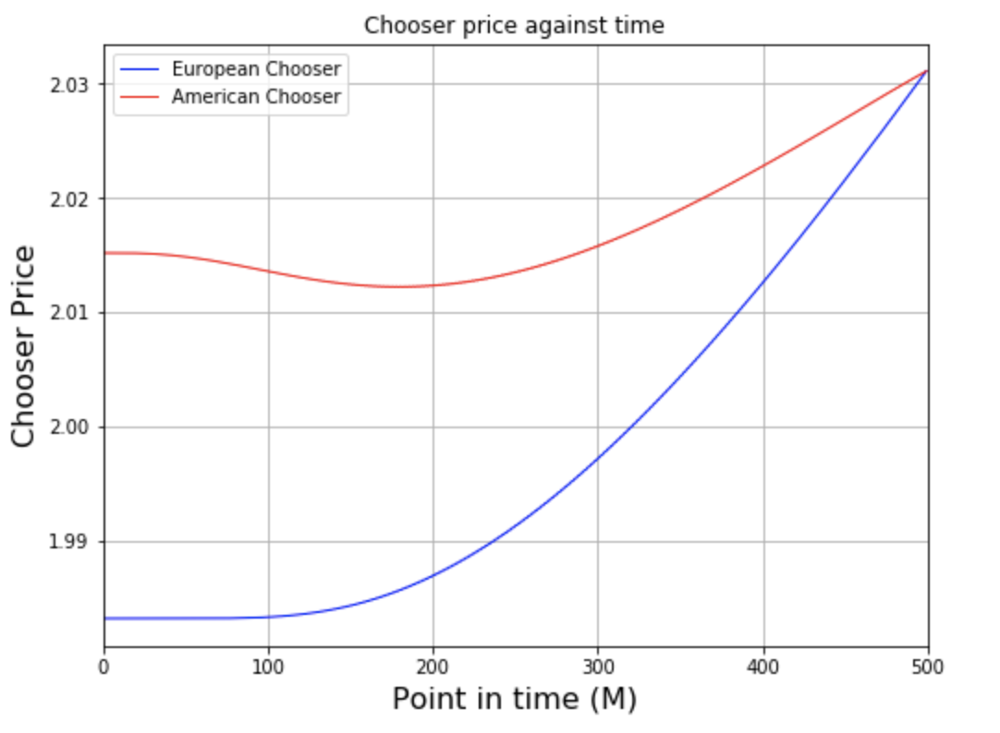

# Options Pricing Problems
My solutions to pricing problems in the Black–Scholes–Merton universe.
The problems include pricing a European chooser option, an American chooser option, certificates, and creating a replicating portfolio

